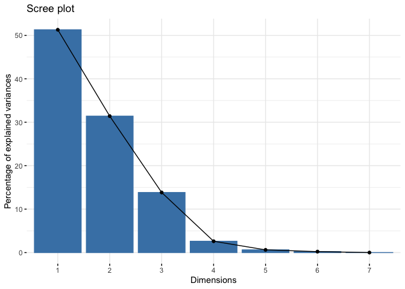
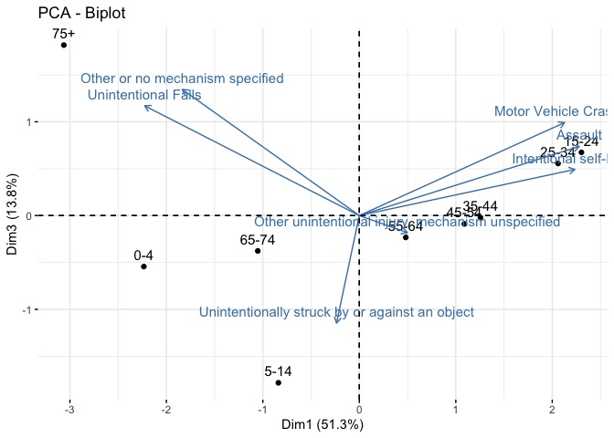

## Data preparation

Download the data from the GitHub
[page](https://github.com/rfordatascience/tidytuesday/blob/master/data/2020/2020-03-31/readme.md)

``` bash
cd data

wget 'https://raw.githubusercontent.com/rfordatascience/tidytuesday/master/data/2020/2020-03-24/tbi_age.csv'
wget 'https://raw.githubusercontent.com/rfordatascience/tidytuesday/master/data/2020/2020-03-24/tbi_year.csv'
wget 'https://raw.githubusercontent.com/rfordatascience/tidytuesday/master/data/2020/2020-03-24/tbi_military.csv'

cd ..
```

I think we will use the `tbi_age.csv` data. It provides the estimated
number and rate (per 100,000) of injuries for various age gruops in
2014.

``` r
library(factoextra)
```

    ## Loading required package: ggplot2

    ## Welcome! Related Books: `Practical Guide To Cluster Analysis in R` at https://goo.gl/13EFCZ

``` r
library(patchwork)
library(tidyverse)
```

    ## ── Attaching packages ─────────────────────────────────────────────────────────────── tidyverse 1.2.1 ──

    ## ✓ tibble  3.0.0           ✓ purrr   0.3.3      
    ## ✓ tidyr   1.0.0           ✓ dplyr   0.8.99.9002
    ## ✓ readr   1.3.1           ✓ stringr 1.4.0      
    ## ✓ tibble  3.0.0           ✓ forcats 0.4.0

    ## ── Conflicts ────────────────────────────────────────────────────────────────── tidyverse_conflicts() ──
    ## x dplyr::filter() masks stats::filter()
    ## x dplyr::lag()    masks stats::lag()

``` r
theme_set(theme_minimal())
```

``` r
tbi_age <- read_csv(file.path("data", "tbi_age.csv")) %>%
    janitor::clean_names()
```

    ## Parsed with column specification:
    ## cols(
    ##   age_group = col_character(),
    ##   type = col_character(),
    ##   injury_mechanism = col_character(),
    ##   number_est = col_double(),
    ##   rate_est = col_double()
    ## )

``` r
head(tbi_age)
```

    ## # A tibble: 6 x 5
    ##   age_group type             injury_mechanism                number_est rate_est
    ##   <chr>     <chr>            <chr>                                <dbl>    <dbl>
    ## 1 0-17      Emergency Depar… Motor Vehicle Crashes                47138     64.1
    ## 2 0-17      Emergency Depar… Unintentional Falls                 397190    540. 
    ## 3 0-17      Emergency Depar… Unintentionally struck by or a…     229236    312. 
    ## 4 0-17      Emergency Depar… Other unintentional injury, me…      55785     75.8
    ## 5 0-17      Emergency Depar… Intentional self-harm                   NA     NA  
    ## 6 0-17      Emergency Depar… Assault                              24360     33.1

There is a “0-17” age group and then smaller sub-groups in the same
range, but I don’t know if they are actual subsets of the “0-17” group
or there is something weird with the data set.

``` r
tbi_age %>%
    filter(
        type == "Emergency Department Visit" & 
        injury_mechanism == "Unintentional Falls" &
        age_group %in% c("0-4", "5-14")
    ) %>%
    pull(number_est) %>%
    sum()
```

    ## [1] 363860

``` r
tbi_age %>%
    filter(
        type == "Emergency Department Visit" & 
        injury_mechanism == "Unintentional Falls" &
        age_group == "0-17"
    ) %>%
    pull(number_est)
```

    ## [1] 397190

The 0-17 group had 397,190 vistis to the ED due to unintentional falls
and the 0-4 and 5-14 groups had 363,860 visits for the same reason,
combined. Thus, they are likely subsets of the 0-17 group. This is
important to avoid double counting.

## EDA

We can plot a PCA of the age groups in a space with axes for the injury
mechanism. Since the rate estimated is per 100,000 people in the age
group, we can sum the `rate_est` values within each age group and injury
mechanism.

``` r
injury_mech <- tbi_age %>%
    filter(!age_group %in% c("Total", "0-17")) %>%
    select(age_group, injury_mechanism, rate_est) %>%
    group_by(age_group, injury_mechanism) %>%
    summarise(rate_est = sum(rate_est)) %>%
    ungroup() %>%
    pivot_wider(age_group,
                names_from = injury_mechanism,
                values_from = rate_est) %>%
    mutate_all(~ ifelse(is.na(.), 0, .)) %>%
    as.data.frame(stringsAsFactors = FALSE) %>%
    column_to_rownames("age_group")

head(injury_mech)
```

    ##       Assault Intentional self-harm Motor Vehicle Crashes
    ## 0-4       9.8                   0.0                  32.8
    ## 15-24   158.6                   7.5                 271.3
    ## 25-34   144.1                   8.5                 194.7
    ## 35-44    93.2                   8.0                 130.7
    ## 45-54    72.9                   9.1                 115.2
    ## 5-14     24.3                   0.0                  54.6
    ##       Other or no mechanism specified
    ## 0-4                             103.3
    ## 15-24                            80.9
    ## 25-34                            53.1
    ## 35-44                            45.9
    ## 45-54                            43.9
    ## 5-14                             65.5
    ##       Other unintentional injury, mechanism unspecified Unintentional Falls
    ## 0-4                                                65.0              1184.7
    ## 15-24                                              92.3               228.8
    ## 25-34                                              58.3               172.3
    ## 35-44                                              50.0               184.9
    ## 45-54                                              49.6               249.0
    ## 5-14                                               78.2               328.6
    ##       Unintentionally struck by or against an object
    ## 0-4                                            271.5
    ## 15-24                                          245.1
    ## 25-34                                          103.8
    ## 35-44                                           81.9
    ## 45-54                                           72.0
    ## 5-14                                           295.8

``` r
injury_mech_pca <- prcomp(injury_mech, scale = TRUE, center = TRUE)
injury_mech_pca
```

    ## Standard deviations (1, .., p=7):
    ## [1] 1.8947612 1.4827307 0.9841179 0.4275008 0.2097278 0.1251177 0.0224620
    ## 
    ## Rotation (n x k) = (7 x 7):
    ##                                                           PC1         PC2
    ## Assault                                            0.47199109 -0.20027471
    ## Intentional self-harm                              0.46245665  0.17448935
    ## Motor Vehicle Crashes                              0.44047806 -0.23067830
    ## Other or no mechanism specified                   -0.37982665 -0.30284002
    ## Other unintentional injury, mechanism unspecified  0.10312677 -0.65405378
    ## Unintentional Falls                               -0.46048678 -0.08466554
    ## Unintentionally struck by or against an object    -0.04884522 -0.59123967
    ##                                                           PC3         PC4
    ## Assault                                            0.29381788  0.17636410
    ## Intentional self-harm                              0.19612787 -0.83548049
    ## Motor Vehicle Crashes                              0.39532844  0.37444788
    ## Other or no mechanism specified                    0.53595959 -0.09518608
    ## Other unintentional injury, mechanism unspecified -0.07250168 -0.11805813
    ## Unintentional Falls                                0.46643521 -0.22244859
    ## Unintentionally struck by or against an object    -0.45700039 -0.24119569
    ##                                                           PC5         PC6
    ## Assault                                           -0.67871220 -0.39736418
    ## Intentional self-harm                              0.08603918  0.08264597
    ## Motor Vehicle Crashes                              0.28866583  0.60888934
    ## Other or no mechanism specified                    0.06173509 -0.10689238
    ## Other unintentional injury, mechanism unspecified  0.48572032 -0.45703525
    ## Unintentional Falls                               -0.23361413  0.19582700
    ## Unintentionally struck by or against an object    -0.39282061  0.45372869
    ##                                                           PC7
    ## Assault                                            0.03365504
    ## Intentional self-harm                             -0.07043036
    ## Motor Vehicle Crashes                              0.04686827
    ## Other or no mechanism specified                   -0.67265843
    ## Other unintentional injury, mechanism unspecified  0.31237616
    ## Unintentional Falls                                0.64870233
    ## Unintentionally struck by or against an object    -0.14438602

``` r
summary(injury_mech_pca)
```

    ## Importance of components:
    ##                           PC1    PC2    PC3     PC4     PC5     PC6     PC7
    ## Standard deviation     1.8948 1.4827 0.9841 0.42750 0.20973 0.12512 0.02246
    ## Proportion of Variance 0.5129 0.3141 0.1384 0.02611 0.00628 0.00224 0.00007
    ## Cumulative Proportion  0.5129 0.8269 0.9653 0.99141 0.99769 0.99993 1.00000

``` r
fviz_eig(injury_mech_pca)
```

<!-- -->

``` r
tibble(
    pc = c(0, seq(1, ncol(injury_mech_pca$x))),
    cum_prop = c(0, cumsum(injury_mech_pca$sdev^2 / sum(injury_mech_pca$sdev^2)))
) %>%
    mutate(label = paste0(round(cum_prop * 100), "%")) %>%
    ggplot(aes(x = pc, y = cum_prop)) +
    geom_hline(yintercept = 0, color = "grey70") +
    geom_vline(xintercept = 0, color = "grey70") +
    geom_line(linetype = 2) +
    geom_point(size = 1.2) +
    geom_text(aes(label = label), family = "Arial", 
              nudge_x = 0.2, nudge_y = -0.03) +
    labs(x = "principal component",
         y = "cumulative proportion")
```

<!-- -->

We can see that the first three dimensions contain 97% of the
information in the new injury mechanism space.

From the plots below, The first dimension is defined by “Unintentional
Falls” in one direction and “Intentional self-harm”, “Assault”, and
“Motor Vehicle Crashes” in the opposite direction, mainly separating
the very old from the young adults and teenagers. The second dimension
is defined by “Unintentionally struck by or against an object” and
“Other unintentional injury, mechanism unspecified” and strifies the
elderly and the young (except for the 75+ and 25-34 age groups). The
third dimension is a combination of these factors and is not as
opinonated at the first two.

``` r
fviz_pca(injury_mech_pca, axes = c(1, 2))  
```

<!-- -->

``` r
fviz_pca(injury_mech_pca, axes = c(1, 3))
```

<!-- -->
