\#TidyTuesdays
================
Joshua Cook
4/7/2020

Tidy Tuesday
============

[`#TidyTuesday`](https://github.com/rfordatascience/tidytuesday) is a
tradition in R where every Tuesday, we practice our data analysis skills
on a new “toy” data set.

Log
---

**August 11, 2020 - Avatar: The Last Airbender**

[data](https://github.com/rfordatascience/tidytuesday/blob/master/data/2020/2020-08-11/readme.md)
\| [analysis](2020-08-11_avatar.md)

I experimented with prior predictive checks with this week’s data set.

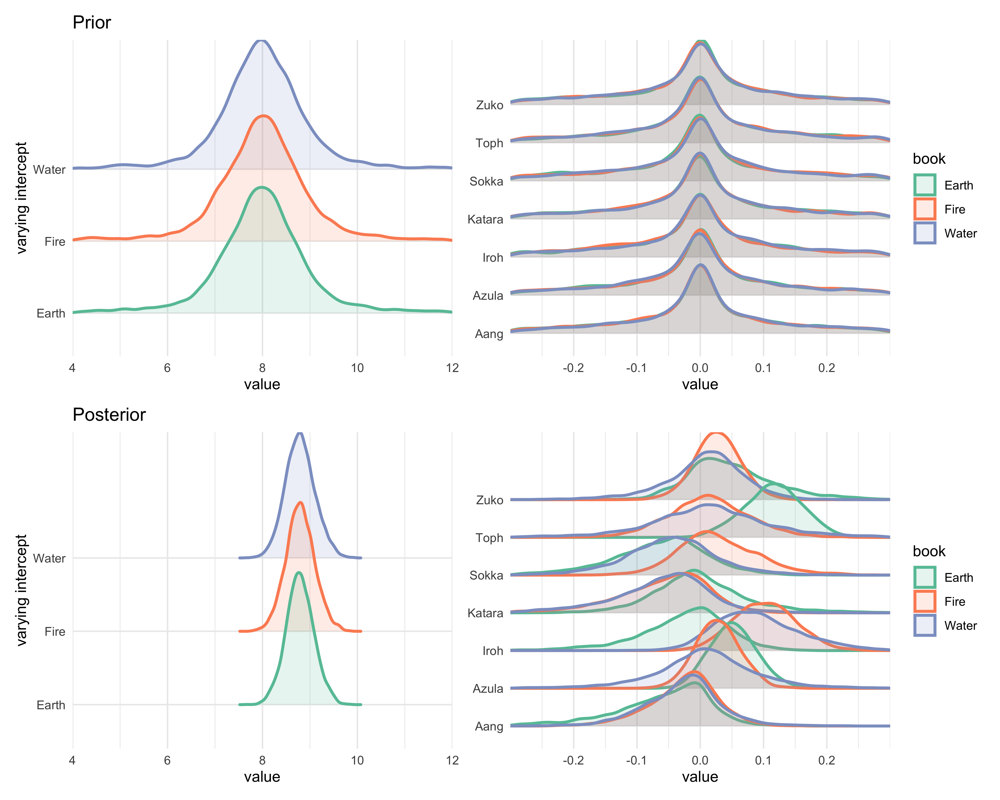

**August 4, 2020 - European energy**

[data](https://github.com/rfordatascience/tidytuesday/blob/master/data/2020/2020-08-04/readme.md)
\| [analysis](2020-08-04_european-energy.md)

Today’s was a bit of a bust because I tried to do some modeling, but
there is not very much data. This weeks data set favored those who like
to do fancy visualizations.

**July 28, 2020 - Palmer Penguins**

[data](https://github.com/rfordatascience/tidytuesday/blob/master/data/2020/2020-07-28/readme.md)
\| [analysis](2020-07-28_palmer-penguins.md)

I took this TidyTuesday as an opporunity to try out the [‘ggeffects’
package](https://strengejacke.github.io/ggeffects/index.html).

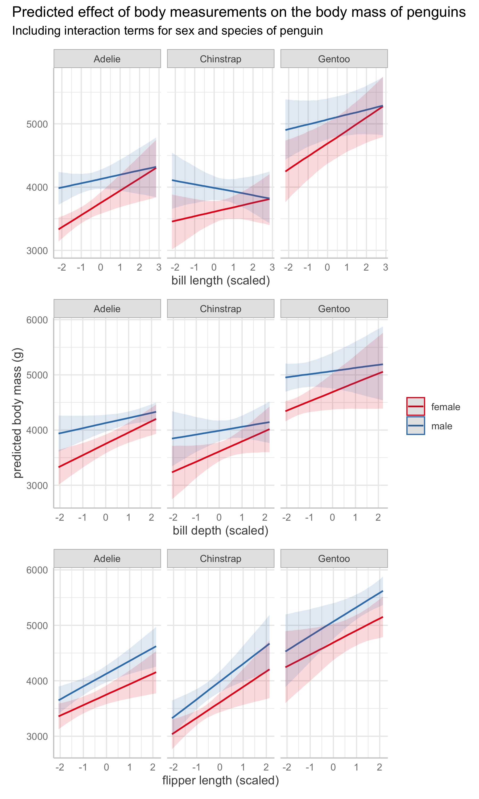

**July 14, 2020 - Astronaut database**

[data](https://github.com/rfordatascience/tidytuesday/blob/master/data/2020/2020-07-14/readme.md)
\| [analysis](2020-07-14_astronaut-database.md)

I compared the same Poisson regression model when fit using frequentist
or Bayesian methods.

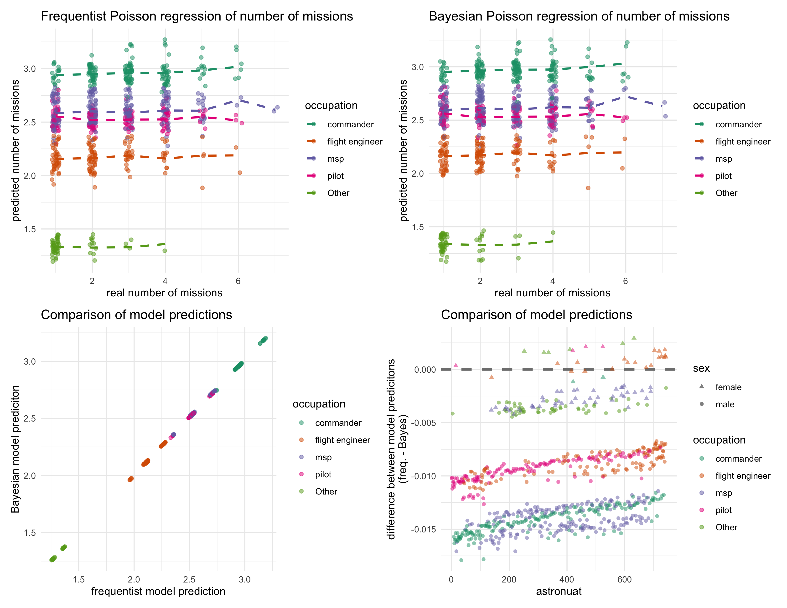

**July 7, 2020 - Coffee Ratings**

[data](https://github.com/rfordatascience/tidytuesday/blob/master/data/2020/2020-07-07/readme.md)
\| [analysis](2020-07-07_coffee-ratings.md)

I practiced linear modeling by building a couple of models including a
logistic regression of the bean processing method regressed on flavor
metrics.

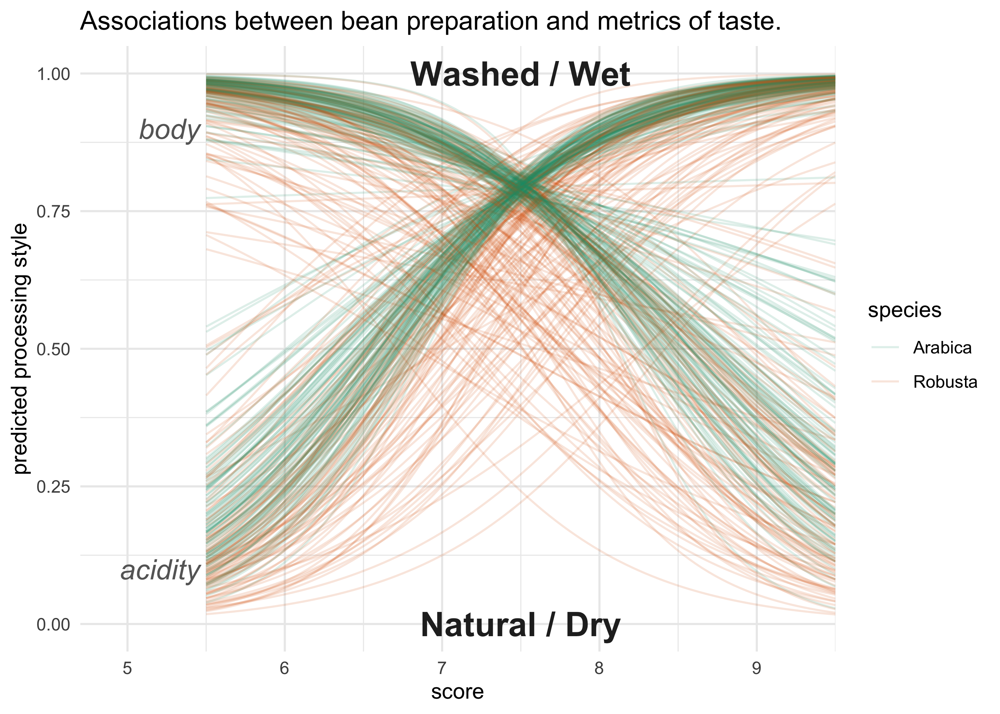

**June 30, 2020 - Uncanny X-men**

[data](https://github.com/rfordatascience/tidytuesday/blob/master/data/2020/2020-06-30/readme.md)
\| [analysis](2020-06-30_uncanny-xmen.md)

I played around with using DBSCAN and Affinity Propagration clustering.

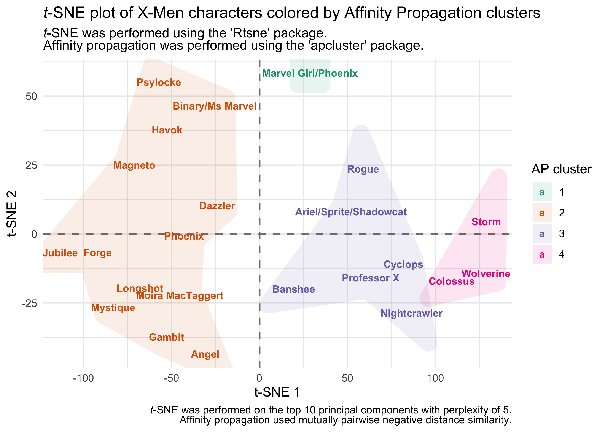

**June 23, 2020 - Caribou Location Tracking**

[data](https://github.com/rfordatascience/tidytuesday/blob/master/data/2020/2020-06-23/readme.md)
\| [analysis](2020-06-23_caribou-location-tracking.md)

I used a linear model with varying intercepts for each caribou to model
the speed of a caribou depending on the season. Without accounting for
the unique intercept for each caribou, the difference in speed was not
detectable.

**June 16, 2020 - International Powerlifting**

[data](https://github.com/rfordatascience/tidytuesday/tree/master/data/2019/2019-10-08)
\| [analysis](2020-06-16_international-powerlifting.md)

I spent more time practicing building and understanding mixed-effects
models.

**June 9, 2020 - Passwords**

[data](https://github.com/rfordatascience/tidytuesday/blob/master/data/2020/2020-01-14/readme.md)
\| [analysis](2020-06-09_passwords.md)

I experimented with various modeling methods, though didn’t do anything
terribly spectacular this time around.

**June 2, 2020 - Marble Racing**

[data](https://github.com/rfordatascience/tidytuesday/blob/master/data/2020/2020-06-02/readme.md)
\| [analysis](2020-06-02_marble-racing.md)

I played around with the data by asking a few smaller questions about
the differences between marbles.

**May 26, 2020 - Volcano Eruptions**

[data](https://github.com/rfordatascience/tidytuesday/blob/master/data/2020/2020-05-26/readme.md)
\| [analysis](2020-05-26_cocktails.md)

I kept it simple this week because the data was quite limited. I
clustered the drinks by their ingredients after doing some feature
engineering to extract information form the list of ingredients.

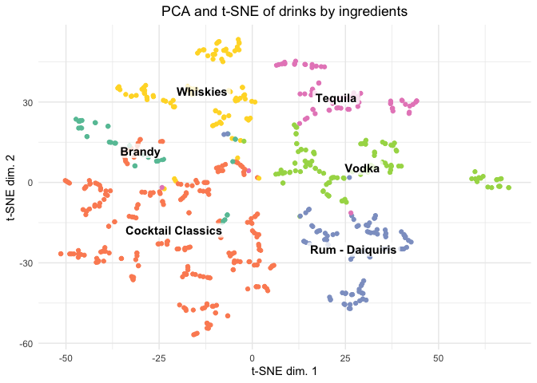

**May 19, 2020 - Volcano Eruptions**

[data](https://github.com/rfordatascience/tidytuesday/blob/master/data/2020/2020-05-19/readme.md)
\| [analysis](2020-05-19_beach-volleyball.md)

I used logisitic models to predict winners and losers of volleyball
matches based on gameplay statistics (e.g. number of attacks, errors,
digs, etc.). I found that including interactions with game duration
increased the performance of the model without overfitting.

**May 12, 2020 - Volcano Eruptions**

[data](https://github.com/rfordatascience/tidytuesday/blob/master/data/2020/2020-05-12/readme.md)
\| [analysis](2020-05-12_volcano-eruptions.md)

I took this as a chance to play around with the suite of packages from
[‘easystats’](https://github.com/easystats/easystats). Towards the end,
I also experiment a bit more with mixed-effects modeling to help get a
better understanding of how to interpret these models.

**May 5, 2020 - Animal Crossing - New Horizons**

[data](https://github.com/rfordatascience/tidytuesday/blob/master/data/2020/2020-05-05/readme.md)
\| [analysis](2020-05-05_animal-crossing-new-horizons.md)

I used sentiment analysis results on user reivews to model their review
grade using a multivariate Bayesian model fit with the quadratic
approximation. The model was pretty awful, but I was able to get some
good practice at this statisticaly techinque I am still learning.

**April 28, 2020 - Broadway Weekly Grosses**

[data](https://github.com/rfordatascience/tidytuesday/blob/master/data/2020/2020-04-28/readme.md)
\| [analysis](2020-04-28_broadway-weekly-grosses.md)

This data set was not very interesting to me as the numerical values
were basically all derived from a single value, making it very difficult
to avoid highly correlative covariates when modeling. Still, I got some
practice at creating an interpreting miced-effects models.

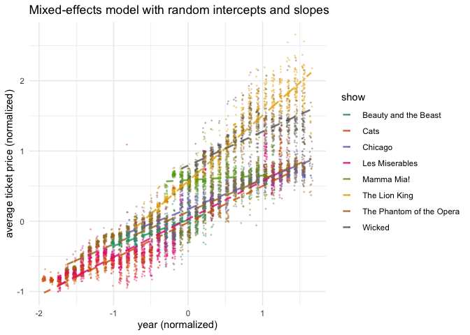

**April 21, 2020 - GDPR Violations**

[data](https://github.com/rfordatascience/tidytuesday/blob/master/data/2020/2020-04-21/readme.md)
\| [analysis](2020-04-21_gdpr-violations.md)

I used the ‘tidytext’ and ‘topicmodels’ packages to group the GDPR fines
based on summaries about the violations.

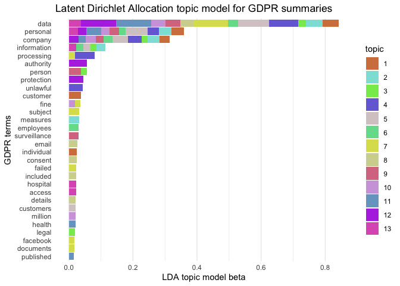

**April 14, 2020 - Best Rap Artists**

[data](https://github.com/rfordatascience/tidytuesday/blob/master/data/2020/2020-04-14/readme.md)
\| [analysis](2020-04-14_best-rap-artists.md)

I built a graph of the songs, artists, and critics using Rap song
rankings.

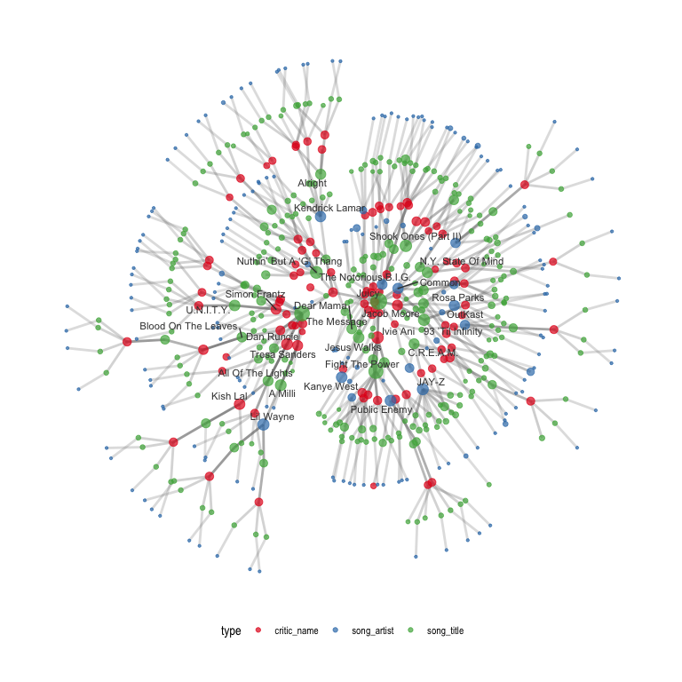

**April 7, 2020 - Tour de France**

[data](https://github.com/rfordatascience/tidytuesday/blob/master/data/2020/2020-04-07/readme.md)
\| [analysis](2020-04-07_tour-de-france.md)

There was quite a lot of data and it took me too long to sort through it
all. Next time, I will focus more on asking a single simple question
rather than trying to understand every aspect of the data.

**March 31, 2020 - Beer Production**

[data](https://github.com/rfordatascience/tidytuesday/blob/master/data/2020/2020-03-31/readme.md)
\| [analysis](2020-03-31_beer-production.md)

I analyzed the number of breweries at varies size categoires and found a
jump of very small microbreweries to higher capacity in 2018 and 2019.

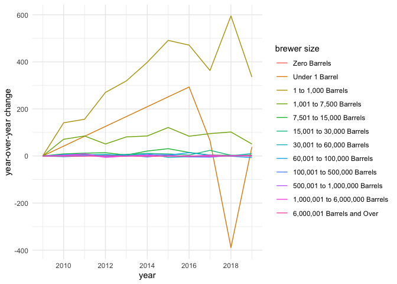

**March 24, 2020 - Traumatic Brain Injury**

[data](https://github.com/rfordatascience/tidytuesday/blob/master/data/2020/2020-03-24/readme.md)
\| [analysis](2020-03-24_traumatic-brain-injury.md)

The data was a bit more limiting because we only had summary statistics
for categorical variables, but I was able to use PCA to identify some
interesting properties of the TBI sustained by the different age groups.

**March 10, 2020 - College Tuition, Diversity, and Pay**

[data](https://github.com/rfordatascience/tidytuesday/blob/master/data/2020/2020-03-10/readme.md)
\| [analysis](2020-03-10_college-tuition-diversity-and-pay.md)

I tried to do some classic linear modeling and mixed effects modeling,
but the dat didn’t really require it. Still, I got some practice with
this method and read plenty about it online during the process.

**March 3, 2020 - Hockey Goals**

[data](https://github.com/rfordatascience/tidytuesday/blob/master/data/2020/2020-03-03/readme.md)
\| [analysis](2020-03-03_hockey-goals.md)

I got some practice build regression models for count data by building
Poisson, Negative Binomial, and Zero-Inflated Poisson regression models
for estimating the effect of various game parameters on the goals scored
by Alex Ovechkin.

**January 21, 2020 - Spotify Songs**

[data](https://github.com/rfordatascience/tidytuesday/blob/master/data/2020/2020-01-21/readme.md)
\| [analysis](2020-01-21_spotify-songs.md)

I used a random forest model to predict the genre of a playlist using
musical features of their songs. I was able to play around with the
‘tidymodels’ framework.

**October 15, 2019**

[data](https://github.com/rfordatascience/tidytuesday/tree/master/data/2019/2019-10-15)
\| [analysis](2019-10-15_big-mtcars.md)

I chose this old TidyTuesday dataset because I wanted to build a simple
linear model using Bayesian methods. I didn’t do too much (and probably
did a bit wrong), but this was a useful exercise to get to play around
with the modeling.

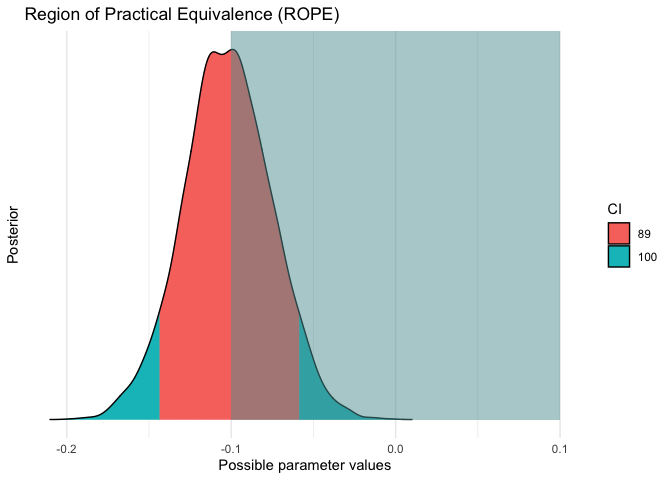
